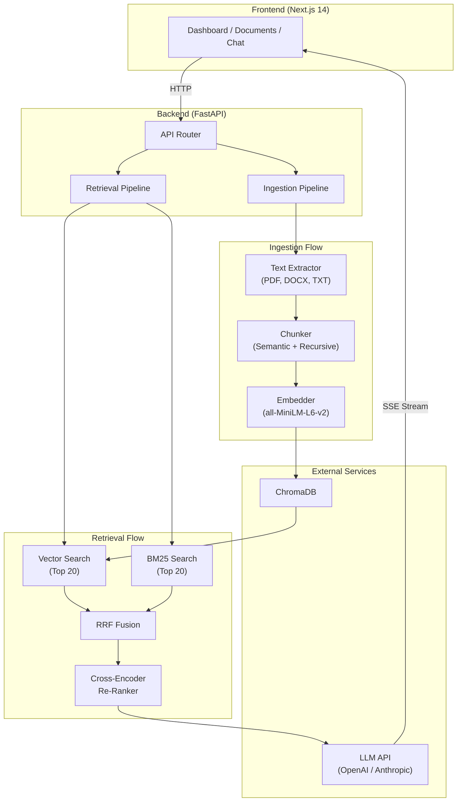

# AskDocs

**Enterprise-grade RAG knowledge base with hybrid search, cross-encoder re-ranking, and citation-forced answers.**

[](https://python.org)
[](https://nextjs.org)
[](https://fastapi.tiangolo.com)
[](https://www.trychroma.com)
[](https://docker.com)
[](LICENSE)

---

## Features

- **Hybrid Search** -- BM25 keyword search + vector semantic search, merged with Reciprocal Rank Fusion (RRF)
- **Cross-Encoder Re-Ranking** -- Two-stage retrieval: fast candidate retrieval, then precise `ms-marco-MiniLM-L-6-v2` re-ranking
- **Citation-Forced Answers** -- Every claim cites `[Source: filename, p.X]` with a hallucination guardrail that refuses to fabricate
- **Confidence Scoring** -- Per-answer confidence derived from cross-encoder relevance scores (green/yellow/red visual indicator)
- **Admin Dashboard** -- Document inventory, chunk statistics, query history, confidence trends, and document type breakdown
- **Multi-Format Ingestion** -- Upload PDF, DOCX, and TXT files with page-level extraction and semantic chunking
- **Streaming Responses** -- Token-by-token Server-Sent Events (SSE) with sources delivered before the answer begins
- **One-Command Deploy** -- `docker-compose up` launches frontend, backend, and ChromaDB with demo data auto-loaded
- **LLM Provider Flexibility** -- Switch between OpenAI and Anthropic with a single environment variable

---

## Architecture



---

## Quick Start

```bash
git clone https://github.com/YOUR_USERNAME/askdocs-rag.git
cd askdocs-rag

cp .env.example .env
# Add your OPENAI_API_KEY to .env

docker-compose up
```

Open [http://localhost:3000](http://localhost:3000). Demo documents are loaded automatically on first startup.

---

## Tech Stack

| Component | Technology | Why |
|-----------|-----------|-----|
| Backend | FastAPI (Python 3.11+) | Async-native, auto-generated OpenAPI docs, SSE support |
| Frontend | Next.js 14 + Tailwind + shadcn/ui | App Router, server components, professional design system |
| Vector Store | ChromaDB | Self-hosted, Docker-native, zero cloud dependency |
| Embeddings | `all-MiniLM-L6-v2` | Free, runs on CPU, 384 dimensions, production-quality |
| Re-Ranker | `ms-marco-MiniLM-L-6-v2` | Free cross-encoder, high accuracy, industry standard |
| Keyword Search | BM25Okapi (`rank-bm25`) | Classic IR algorithm, complements vector search |
| LLM | GPT-4o-mini (default) / Claude 3.5 Sonnet | Configurable via env var, cheapest quality options |
| Infrastructure | Docker Compose (3 services) | One-command deploy, reproducible environments |

---

## API Reference

| Method | Path | Description |
|--------|------|-------------|
| `GET` | `/health` | Health check |
| `POST` | `/api/documents/upload` | Upload one or more files (PDF, DOCX, TXT) |
| `GET` | `/api/documents` | List all documents with metadata |
| `GET` | `/api/documents/{doc_id}` | Single document detail with chunk preview |
| `GET` | `/api/documents/{doc_id}/chunks` | Paginated chunks for a document |
| `DELETE` | `/api/documents/{doc_id}` | Delete document and all its chunks |
| `POST` | `/api/chat` | Query the knowledge base (SSE streaming response) |
| `GET` | `/api/stats` | Dashboard statistics and recent queries |

Full interactive docs available at [http://localhost:8000/docs](http://localhost:8000/docs) (Swagger UI).

---

## Project Structure

```
askdocs-rag/
├── docker-compose.yml
├── .env.example
│
├── backend/
│   ├── Dockerfile
│   ├── requirements.txt
│   └── app/
│       ├── main.py                    # FastAPI app, CORS, lifespan
│       ├── config.py                  # Pydantic settings from env vars
│       ├── routers/
│       │   ├── documents.py           # Upload, list, delete, view chunks
│       │   ├── chat.py                # Query endpoint (SSE streaming)
│       │   └── stats.py               # Dashboard statistics
│       ├── services/
│       │   ├── ingestion.py           # Extract -> Chunk -> Embed -> Store
│       │   ├── text_extractor.py      # PDF, DOCX, TXT extraction
│       │   ├── chunker.py             # Semantic + recursive chunking
│       │   ├── embedder.py            # Sentence-transformers wrapper
│       │   ├── reranker.py            # Cross-encoder wrapper
│       │   ├── hybrid_search.py       # BM25 + Vector + RRF fusion
│       │   ├── retrieval.py           # Search -> Re-rank -> LLM -> Cited answer
│       │   ├── llm_client.py          # OpenAI / Anthropic abstraction
│       │   ├── bm25_index.py          # In-memory BM25 index
│       │   └── chroma_client.py       # ChromaDB connection and operations
│       ├── models/
│       │   └── schemas.py             # Pydantic request/response models
│       └── data/
│           └── demo_docs/             # Pre-loaded demo documents
│
└── frontend/
    ├── Dockerfile
    ├── package.json
    └── app/
        ├── layout.tsx                 # Root layout with sidebar navigation
        ├── page.tsx                   # Dashboard (stats, recent queries, charts)
        ├── documents/page.tsx         # Document upload and management
        └── chat/page.tsx              # Chat interface with source panel
```

---

## How It Works

### Ingestion Pipeline

1. **Extract** -- Text is pulled from uploaded files using format-specific extractors (PyPDF2, python-docx, or raw read), preserving page numbers.
2. **Chunk** -- Text is split by headings and paragraph boundaries first, then recursively at sentence boundaries if chunks exceed 500 tokens. 50-token overlap ensures context is not lost at boundaries.
3. **Embed** -- Each chunk is embedded using `all-MiniLM-L6-v2` (384-dimensional vectors, runs locally on CPU).
4. **Store** -- Embeddings, text, and metadata (document name, page number, chunk index) are stored in ChromaDB. Chunks are also indexed in an in-memory BM25 index.

### Retrieval Pipeline

1. **Hybrid Search** -- The query is run through both vector search (top 20 by cosine similarity) and BM25 keyword search (top 20 by TF-IDF) in parallel.
2. **RRF Fusion** -- Results are merged using Reciprocal Rank Fusion (`score = 1/(k + rank)`, k=60), deduplicated, and sorted.
3. **Cross-Encoder Re-Ranking** -- The top 20 fused candidates are re-scored by a cross-encoder (`ms-marco-MiniLM-L-6-v2`) that evaluates each (query, chunk) pair together. The top 5 are kept.
4. **LLM Generation** -- The top 5 chunks are sent to the LLM with a system prompt enforcing citation format and hallucination refusal. The answer streams token-by-token via SSE.
5. **Response Assembly** -- Citations are parsed, confidence is computed from re-ranker scores, and retrieval metadata (timing, candidate counts) is attached.

---

## Configuration

| Variable | Default | Description |
|----------|---------|-------------|
| `LLM_PROVIDER` | `openai` | LLM provider: `openai` or `anthropic` |
| `OPENAI_API_KEY` | -- | OpenAI API key (required if provider is openai) |
| `ANTHROPIC_API_KEY` | -- | Anthropic API key (required if provider is anthropic) |
| `LLM_MODEL` | `gpt-4o-mini` | Model name (e.g., `gpt-4o-mini`, `claude-3-5-sonnet-20241022`) |
| `CHROMA_HOST` | `chromadb` | ChromaDB hostname (Docker service name) |
| `CHROMA_PORT` | `8100` | ChromaDB port |
| `CHUNK_SIZE` | `500` | Target chunk size in tokens |
| `CHUNK_OVERLAP` | `50` | Overlap between consecutive chunks in tokens |
| `RETRIEVAL_TOP_K` | `5` | Number of chunks sent to the LLM |
| `VECTOR_SEARCH_K` | `20` | Initial vector search candidates |
| `BM25_SEARCH_K` | `20` | Initial keyword search candidates |
| `CORS_ORIGINS` | `http://localhost:3000` | Allowed CORS origins |

---

## Cost

The entire retrieval stack -- embeddings, re-ranking, vector storage, keyword search -- runs locally at **zero cost**. No paid embedding APIs, no cloud vector database fees.

Only the final answer generation calls a paid LLM API. With GPT-4o-mini, each query costs approximately **$0.001** (one-tenth of a cent). A full development and demo cycle runs well under $1.

---

## License

[MIT](LICENSE)
